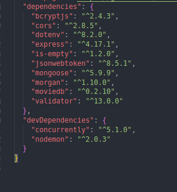
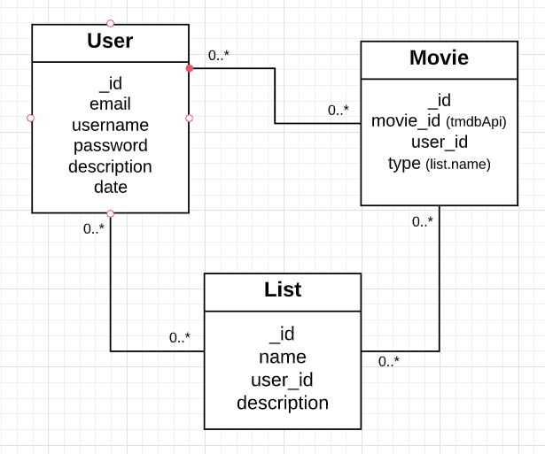
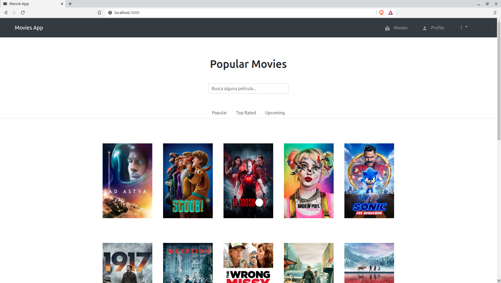
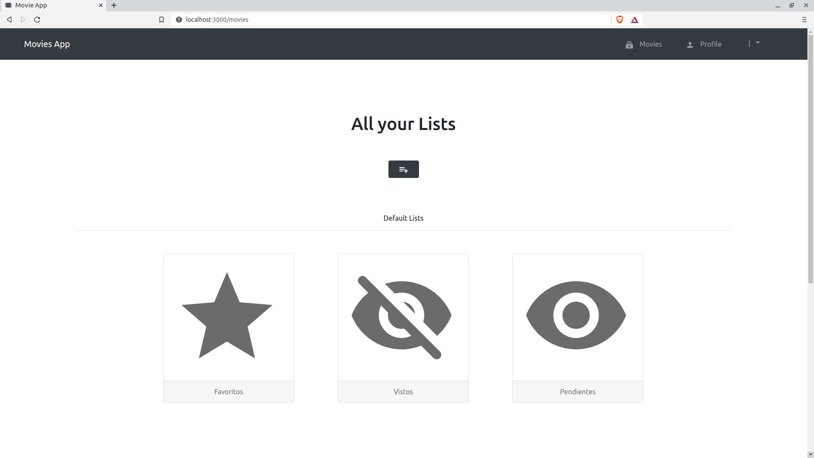
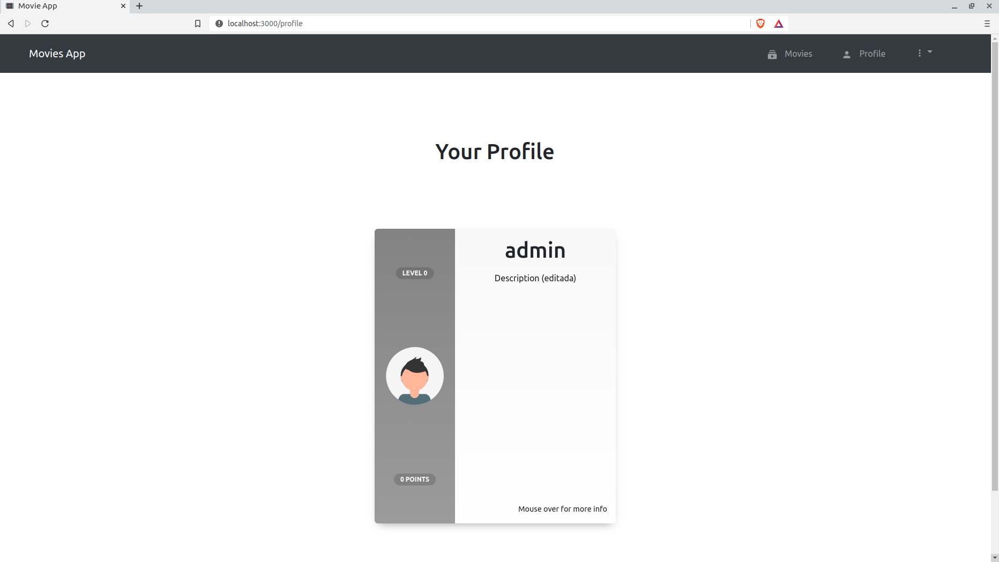

# MoviesApp


</br>
MoviesApp is an application that allows you to classify movies in lists. It offers you to keep an order for the movies that you have seen or you want to see, in addition you can create your own movies lists.
</br>
</br>
</br>


</br>
</br>

## Table of contents

1. [Technologies](#techs)
2. [File Structure](#filesStr)
3. [Prerequisites](#pre)
4. [Installing](#installing)
5. [Deployment](#dep)
6. [About the App](#app)

    6.1. [Data models](#models)

    6.2. [Api Routes](#apiroutes)

    6.3. [Screenshots](#screens)
7. [Contributing](#contributing)
8. [BUGs or comments](#bugs)
9. [Version](#version)
10. [Authors](#autors)


<a name="techs"></a>

## Technologies

This project uses the following technologies:

- [React](https://reactjs.org) ,  [React Router](https://reacttraining.com/react-router/) and [React-bootstrap](https://react-bootstrap.github.io/) for frontend

- [Express](http://expressjs.com/) and [Node](https://nodejs.org/en/) for the backend

- [MongoDB](https://www.mongodb.com/) for the database

  

  - Dependencies

  | **Backend**                                          | Frontend                                             |
  | ---------------------------------------------------- | ---------------------------------------------------- |
  |  |  |


<a name="filesStr"></a>

## File Structure

```bash
MoviesApp
  ├── docs/
  └── client
      ├── node_modules/
      ├── package.json
      ├── package-lock.json
      ├── public/
      └── src
          ├── components
          │   ├── lists/
          │   ├── movies/
          │   ├── partials/
          │   └── users/
          ├── helpers/
          ├── styles/
          ├── svg/
          ├── views/
          ├── App.js
          ├── index.js
          └── setupProxy.js
  ├── node_modules/
  ├── package.json
  ├── package-lock.json
  ├── README.md
  └── server
      ├── config
      │   └── serverAuth.js
      ├── controllers
      │   ├── lists.controllers.js
      │   ├── movies.controllers.js
      │   └── users.controllers.js
      ├── database.js
      ├── index.js
      ├── models
      │   ├── List.js
      │   ├── Movie.js
      │   └── User.js
      ├── routes
      │   ├── index.js
      │   ├── lists.routes.js
      │   ├── movies.routes.js
      │   └── users.routes.js
      ├── server.js
      └── validator
          ├── login.js
          └── register.js
```


<a name="pre"></a>

## Prerequisites

- [MongoDB](https://gist.github.com/nrollr/9f523ae17ecdbb50311980503409aeb3)
- [Node](https://nodejs.org/en/download/)
- [npm](https://nodejs.org/en/download/package-manager/)

You need to create a .env file on the root of the project and put your JWT_SECRET key like that:

```
JWT_SECRET=secret
```


<a name="installing"></a>

## Installing

1. Fork, then download or clone the repo.
```bash
git clone https://github.com/mariobalrod/MoviesApp.git
```
2. Make sure **MongoDB** service is running.

3. For the **Back-end**, install the dependencies once via the terminal.
```bash
npm install
```

4. For the **Front-end**, install the dependencies once via the terminal.
```bash
cd client/
npm install
```


<a name="dep"></a>

## Deployment

To deploy simply run the next command on the root of the project

```
npm run dev
```

<a name="app"></a>

## About the App


<a name="models"></a>

### Data Models




<a name="apiroutes"></a>

### Api Routes
```javascript
// Api Movies Routes
router.get('/', getAllMovies);
router.get('/:id', getMovieById);
router.get('/:type/:user', getMoviesByType);
router.post('/add', createMovie);
router.post('/types', updateTypeMovies);
router.put('/:id', updateMovie);
router.delete('/:type/:user', deleteMoviesByType);
router.delete('/delete', deleteMovie);
router.delete('/:id', deleteMovieById);
router.get('/count/:type/:user', getCountMoviesByType);
```

```javascript
// Api Users Routes
router.post('/login', login);
router.post('/register', registerUser);
router.post('/description/:id', updateDescription);
router.get('/description/:id', getDescription)
router.put('/password/:id', updatePassword);
router.get('/', getAllUsers);
router.get('/:id', getUserById);
router.delete('/:id', deleteUser);
```

```javascript
// Api Lists Routes
router.get('/', getAllLists);
router.get('/:id', getListById);
router.get('/own/:user', getLists);
router.post('/create', createList);
router.post('/update/:id', updateList);
router.delete('/:id', deleteListById);
router.get('/count/:user', getCountList);
```

<a name="screens"></a>

### Screenshots

**Home Page**

</br>
</br>
</br>

**Lists Page**

</br>
</br>
</br>

**Profile Page**


<a name="contributing"></a>

## Contributing

Please feel free to send pull request if you want to contribute!


<a name="bugs"></a>

## BUGs or comments

[Create new Issues](https://github.com/mariobalrod/MoviesApp/issues) (preferred)

or Email Me: marioballestero.rdg@gmail.com 

<a name="version"></a>

## Version

1.0.0

<a name="autors"></a>

## Authors

- **Mario Ballestero** - _Development_ - [mariobalrod](https://github.com/mariobalrod)